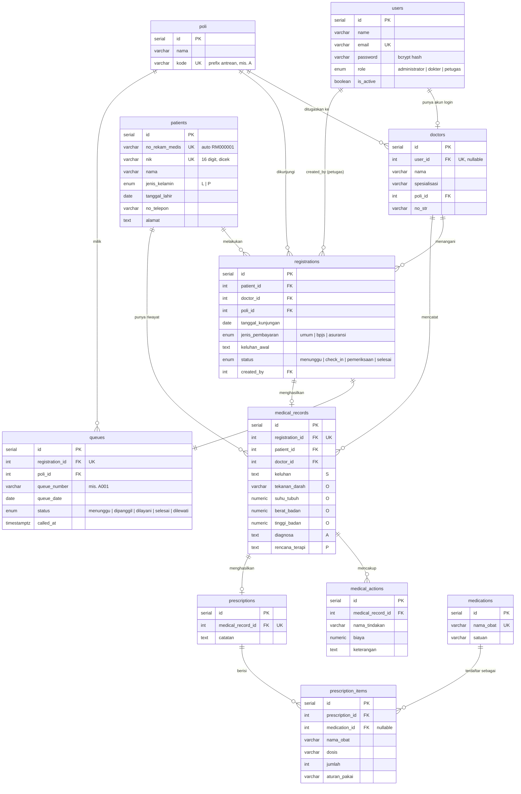

# Nexa Clinic — Sistem Informasi Klinik Mini

Aplikasi web untuk mengelola data pasien, pendaftaran, antrean, dan pemeriksaan medis dengan metode SOAP. Dilengkapi autentikasi JWT dan tiga peran pengguna.

Dibuat sebagai technical assignment: frontend **React**, REST API **Node.js / Express**, dan database **PostgreSQL**.

---

## Daftar Isi

- [Teknologi](#teknologi)
- [Fitur](#fitur)
- [Struktur Proyek](#struktur-proyek)
- [Desain Database (ERD)](#desain-database-erd)
- [Prasyarat](#prasyarat)
- [Cara Menjalankan](#cara-menjalankan)
  - [1. Clone Repository](#1-clone-repository)
  - [2. Setup Database (Migrasi)](#2-setup-database-migrasi)
  - [3. Setup Backend](#3-setup-backend)
  - [4. Setup Frontend](#4-setup-frontend)
- [Akun Demo](#akun-demo)
- [Variabel Lingkungan (.env)](#variabel-lingkungan-env)
- [Daftar API](#daftar-api)
- [Hak Akses per Peran](#hak-akses-per-peran)
- [Catatan & Asumsi](#catatan--asumsi)

---

## Teknologi

| Lapisan   | Teknologi                                               |
| --------- | ------------------------------------------------------- |
| Frontend  | React 18, Vite, React Router v6, Tailwind CSS, Axios    |
| Backend   | Node.js, Express, JSON Web Token (JWT), bcryptjs        |
| Database  | PostgreSQL                                              |
| Validasi  | express-validator                                       |

---

## Fitur

- **Autentikasi & Otorisasi** — login / logout dengan JWT; tiga peran (Administrator, Dokter, Petugas Pendaftaran) dengan kontrol akses di setiap halaman dan endpoint.
- **Master Data Pasien** — CRUD lengkap dengan nomor rekam medis otomatis (`RM000001`…), NIK 16 digit yang unik, pencarian, dan pagination.
- **Pendaftaran** — mendaftarkan kunjungan pasien ke poli dan dokter tujuan, lengkap dengan jenis pembayaran dan keluhan awal.
- **Antrean** — nomor antrean otomatis per poli per hari, panggil antrean, dan perubahan status (menunggu → dipanggil → dilayani → selesai / dilewati).
- **Pemeriksaan (SOAP)** — Subjective, Objective (tanda vital), Assessment, Plan, ditambah tindakan medis dan resep obat, beserta riwayat pemeriksaan per pasien.
- **Dashboard** — ringkasan harian: total pasien, pasien hari ini, antrean hari ini, menunggu, dan selesai.

---

## Struktur Proyek

```
nexa-clinic-system/
├── backend/
│   ├── src/
│   │   ├── config/         # koneksi database (pool)
│   │   ├── controllers/    # auth, patient, registration, queue,
│   │   │                   # medicalRecord, prescription, dashboard, master
│   │   ├── middleware/     # auth (JWT + peran), validate, response, errorHandler
│   │   ├── routes/         # satu router per resource + index
│   │   ├── validators/     # aturan validasi express-validator
│   │   ├── utils/          # asyncHandler, ApiError
│   │   └── index.js        # entry point (semua route di-mount ke /api)
│   ├── .env.example
│   └── package.json
├── frontend/
│   ├── src/
│   │   ├── api/            # axios client (menyisipkan JWT, menangani 401)
│   │   ├── context/        # AuthContext
│   │   ├── components/     # Layout, Modal, Pagination, ProtectedRoute, dll.
│   │   ├── lib/            # constants (peran, status, menu navigasi)
│   │   ├── pages/          # Login, Dashboard, Patients, Registrations, Queue, Examination
│   │   ├── App.jsx         # definisi route
│   │   └── main.jsx        # entry point
│   ├── index.html
│   ├── vite.config.js
│   ├── tailwind.config.js
│   ├── postcss.config.js
│   ├── .env.example
│   └── package.json
├── docs/
│   ├── ERD.md              # diagram relasi entitas (Mermaid)
│   └── erd.png
├── database.sql            # skema + data awal (seed)
└── README.md
```

---

## Desain Database (ERD)

Database: **PostgreSQL**. Diagram berikut dirender otomatis oleh GitHub (Mermaid).



**Catatan relasi:**

- Seorang **dokter** dapat ditautkan ke satu **user** (peran `dokter`) sehingga orang yang sama bisa login sekaligus dipilih saat pendaftaran.
- Setiap **registrations** menghasilkan tepat satu baris **queues** (`registration_id` bersifat unik).
- **medical_records** dibuat hanya setelah dokter memeriksa pasien, jadi satu registrasi memiliki *nol atau satu* rekam medis.
- **SOAP** dipetakan ke kolom pada `medical_records`: `keluhan` (S), tanda vital (O), `diagnosa` (A), `rencana_terapi` (P).
- `medical_actions` (tindakan) serta `prescriptions` → `prescription_items` (resep) menempel pada rekam medis, sehingga tiap kunjungan memiliki jejak klinis yang lengkap.
- Riwayat pemeriksaan pasien = seluruh `medical_records` untuk sebuah `patient_id`, diurutkan berdasarkan tanggal.

---

## Prasyarat

- **Node.js** v18 atau lebih baru
- **PostgreSQL** v14 atau lebih baru
- **npm** (sudah termasuk saat instalasi Node.js)

---

## Cara Menjalankan

### 1. Clone Repository

```bash
git clone https://github.com/suadda/mini-clinic-system.git
cd mini-clinic-system
```

### 2. Setup Database (Migrasi)

Buat database, lalu import skema dan data awal dari `database.sql`. File ini sudah berisi seluruh tabel, constraint, index, dan data awal — tidak perlu tool migrasi terpisah.

**Opsi A — melalui `psql` (command line):**

```bash
# buat database
createdb clinic_db

# import skema + data awal
psql -U postgres -d clinic_db -f database.sql
```

**Opsi B — melalui GUI (DBeaver / pgAdmin):**

1. Buat database baru dengan nama `clinic_db`.
2. Buka SQL editor yang **terhubung ke `clinic_db`** (bukan database bawaan `postgres`).
3. Buka file `database.sql`, lalu jalankan seluruh skrip.

Skrip aman dijalankan ulang karena memakai `DROP ... IF EXISTS` sebelum membuat objek.

### 3. Setup Backend

```bash
cd backend
npm install
cp .env.example .env        # Windows: copy .env.example .env
```

Buka file `.env`, lalu sesuaikan password PostgreSQL Anda (dan nilai lain bila perlu). Kemudian jalankan server:

```bash
npm run dev                 # mode development (nodemon)
# atau
npm start                   # mode production
```

Backend berjalan di **http://localhost:5000**. Seluruh endpoint berada di bawah prefix `/api` (contoh: `http://localhost:5000/api/login`).

### 4. Setup Frontend

Buka **terminal kedua** (biarkan backend tetap berjalan):

```bash
cd frontend
npm install
cp .env.example .env        # Windows: copy .env.example .env
npm run dev
```

Aplikasi berjalan di **http://localhost:5173**. Buka di browser, lalu login memakai salah satu akun demo di bawah.

---

## Akun Demo

Semua akun demo memakai password **`password123`**.

| Peran                | Email               | Akses                                              |
| -------------------- | ------------------- | -------------------------------------------------- |
| Administrator        | `admin@clinic.com`  | Akses penuh ke seluruh modul                       |
| Dokter               | `dokter@clinic.com` | Antrean + Pemeriksaan (SOAP, tindakan, resep)      |
| Petugas Pendaftaran  | `petugas@clinic.com`| Data Pasien, Pendaftaran, Antrean                  |

---

## Variabel Lingkungan (.env)

**Backend** (`backend/.env`)

| Variabel         | Keterangan                           | Contoh               |
| ---------------- | ------------------------------------ | -------------------- |
| `PORT`           | Port tempat API berjalan             | `5000`               |
| `DB_HOST`        | Host PostgreSQL                      | `localhost`          |
| `DB_PORT`        | Port PostgreSQL                      | `5432`               |
| `DB_USER`        | User PostgreSQL                      | `postgres`           |
| `DB_PASSWORD`    | Password PostgreSQL                  | `your_password`      |
| `DB_NAME`        | Nama database                        | `clinic_db`          |
| `JWT_SECRET`     | Kunci rahasia untuk menandatangani JWT | `ganti_dengan_string_acak` |
| `JWT_EXPIRES_IN` | Masa berlaku token                   | `1d`                 |

**Frontend** (`frontend/.env`)

| Variabel        | Keterangan                          | Contoh                  |
| --------------- | ----------------------------------- | ----------------------- |
| `VITE_API_URL`  | Base URL backend (tanpa `/api`)     | `http://localhost:5000` |

> Tidak ada kredensial yang ditulis langsung di dalam kode. Kedua file `.env` diabaikan oleh git; hanya template `.env.example` yang di-commit ke repository.

---

## Daftar API

Base URL: **`http://localhost:5000/api`**

Seluruh endpoint kecuali `POST /login` membutuhkan header `Authorization: Bearer <token>`.

| Method | Endpoint                      | Keterangan                                    | Peran                          |
| ------ | ----------------------------- | --------------------------------------------- | ------------------------------ |
| POST   | `/login`                      | Autentikasi, mengembalikan JWT                | Publik                         |
| POST   | `/logout`                     | Logout                                        | Terautentikasi                 |
| GET    | `/patients`                   | Daftar pasien (pencarian, pagination)         | Administrator, Petugas         |
| POST   | `/patients`                   | Tambah pasien                                 | Administrator, Petugas         |
| PUT    | `/patients/:id`               | Ubah pasien                                   | Administrator, Petugas         |
| DELETE | `/patients/:id`               | Hapus pasien                                  | Administrator                  |
| GET    | `/registrations`              | Daftar pendaftaran                            | Administrator, Petugas, Dokter |
| POST   | `/registrations`              | Buat pendaftaran                              | Administrator, Petugas         |
| PUT    | `/registrations/:id`          | Ubah pendaftaran                              | Administrator, Petugas         |
| GET    | `/queues`                     | Daftar antrean hari ini                       | Semua                          |
| POST   | `/queues`                     | Buat nomor antrean                            | Administrator, Petugas         |
| PUT    | `/queues/:id/call`            | Panggil antrean                               | Semua                          |
| PUT    | `/queues/:id/status`          | Ubah status antrean                           | Semua                          |
| POST   | `/medical-records`            | Buat rekam medis SOAP (+ tindakan, resep)     | Administrator, Dokter          |
| GET    | `/medical-records/:patientId` | Riwayat pemeriksaan pasien                    | Administrator, Dokter          |
| POST   | `/prescriptions`              | Buat resep                                    | Administrator, Dokter          |
| GET    | `/prescriptions/:id`          | Ambil detail resep                            | Administrator, Dokter          |
| GET    | `/dashboard`                  | Ringkasan angka dashboard                     | Semua                          |
| GET    | `/poli`                       | Daftar poli (untuk dropdown)                  | Terautentikasi                 |
| GET    | `/doctors`                    | Daftar dokter (untuk dropdown)                | Terautentikasi                 |
| GET    | `/medications`                | Daftar obat (untuk dropdown)                  | Terautentikasi                 |

### Format Response

Setiap response mengikuti format yang konsisten.

**Sukses**

```json
{
  "success": true,
  "message": "Login berhasil",
  "data": { }
}
```

**Error**

```json
{
  "success": false,
  "message": "Validasi gagal",
  "errors": { "nik": "NIK harus 16 digit angka" }
}
```

---

## Hak Akses per Peran

| Modul                 | Administrator | Dokter | Petugas Pendaftaran |
| --------------------- | :-----------: | :----: | :-----------------: |
| Dashboard             | ✓             | ✓      | ✓                   |
| Data Pasien (CRUD)    | ✓             | –      | ✓                   |
| Pendaftaran           | ✓             | –      | ✓                   |
| Antrean               | ✓             | ✓      | ✓                   |
| Pemeriksaan (SOAP)    | ✓             | ✓      | –                   |

---

## Catatan & Asumsi

- Seluruh route API berada di bawah prefix **`/api`**. Saat pengujian dengan Postman, gunakan `http://localhost:5000/api` sebagai base URL.
- Nomor rekam medis dibuat otomatis oleh database (`RM` + nomor urut dengan padding nol).
- Nomor antrean dibuat per poli per hari, dengan format kode poli + nomor urut (contoh: `A001`).
- Password di-hash menggunakan bcrypt; password akun demo adalah `password123`.
- JWT disimpan di `localStorage` browser dan otomatis disisipkan pada setiap request melalui Axios interceptor; response `401` akan menghapus sesi dan mengarahkan kembali ke halaman login.
- `database.sql` sekaligus berfungsi sebagai file migrasi — idempoten (aman dijalankan ulang) dan sudah menyertakan data awal untuk pengujian.