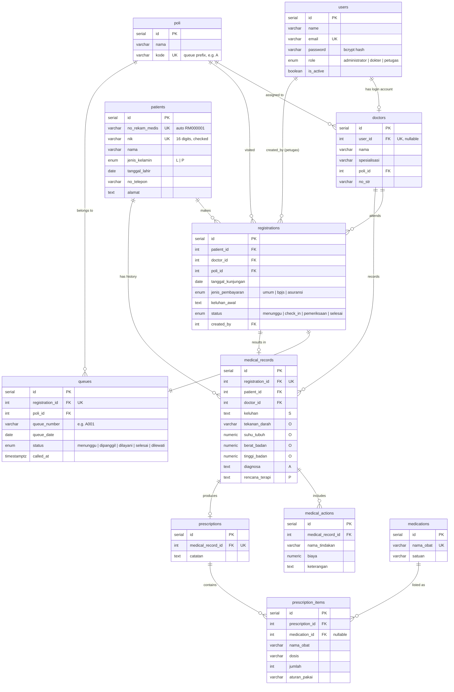

# Entity Relationship Diagram — Mini Clinic Information System

Database: **PostgreSQL**. This diagram renders automatically on GitHub.

## Relationship notes

- A **doctor** is optionally linked to a **user** (role `dokter`) so the same person can both log in and be selected during registration.
- Each **registration** generates exactly one **queue** row (`registration_id` is unique).
- A **medical record** is created only after the doctor examines the patient, so a registration has *zero or one* record.
- **SOAP** maps to columns on `medical_records`: `keluhan` (S), vitals (O), `diagnosa` (A), `rencana_terapi` (P).
- `medical_actions` (tindakan) and `prescriptions` → `prescription_items` (resep) hang off a medical record, giving each visit a full clinical trail.
- Patient examination history = all `medical_records` for a `patient_id`, ordered by date.
